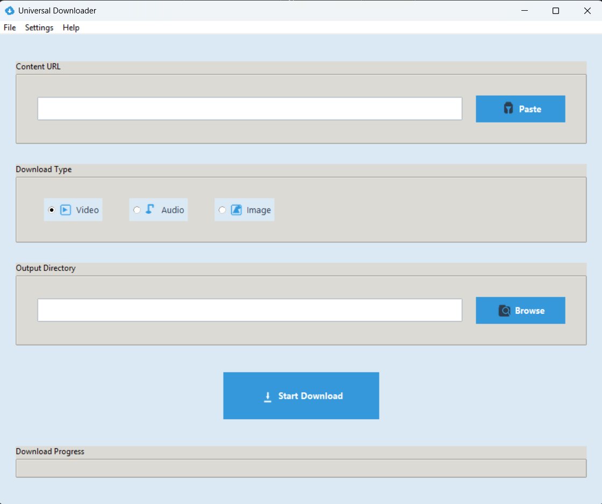

# Universal Downloader App

A modern and intuitive desktop application built with Python's Tkinter and powerful backend libraries (`yt-dlp`, `requests`) for downloading various types of content from the web. Easily download videos, extract audio, or save images from supported URLs.

## ✨ Features

* **Universal URL Support:** Download content from popular platforms like YouTube, TikTok, and direct image links.
* **Multiple Download Types:**
    * **Video:** Download videos in the best available quality.
    * **Audio:** Extract and download audio (MP3) from video or music links.
    * **Image:** Download images directly from their URLs.
* **Intuitive User Interface:** Clean, modern, and user-friendly design with a focus on ease of use.
* **Clipboard Integration:** Quickly paste URLs from your clipboard.
* **Customizable Output Directory:** Choose where your downloaded files are saved.
* **Real-time Progress Tracking:** Monitor download progress with a progress bar and detailed status messages.
* **Download Log:** View a comprehensive log of all download activities and messages.
* **Responsive Design:** The application window is resizable and adapts gracefully.
* **Custom Icons:** Features custom-generated icons for a polished look.

## 📸 Screenshot


_A clear view of the Universal Downloader's main interface, showcasing its clean design and input fields._

*(Ensure your screenshot file is named `img.png` and is located in the same directory as this `README.md` file in your GitHub repository.)*

## 🚀 Installation

1.  **Clone the repository:**
    ```bash
    git clone [https://github.com/your-username/universal-downloader.git](https://github.com/your-username/universal-downloader.git)
    cd universal-downloader
    ```

2.  **Create a virtual environment (recommended):**
    ```bash
    python -m venv venv
    # On Windows:
    .\venv\Scripts\activate
    # On macOS/Linux:
    source venv/bin/activate
    ```

3.  **Install dependencies:**
    ```bash
    pip install yt-dlp requests Pillow
    ```

4.  **Generate Icons:**
    This app uses custom icons. Run the `icon_generate.py` script to create the `icons` directory and populate it with necessary image files.
    ```bash
    python icon_generate.py
    ```

## 🎨 Usage

1.  **Run the application:**
    ```bash
    python main.py
    ```

2.  **Paste URL:**
    * Copy a video (YouTube, TikTok), music, or direct image URL to your clipboard.
    * Click the "Paste" button next to the "Content URL" input field, or simply type/paste the URL directly.

3.  **Select Download Type:**
    * Choose between "Video", "Audio", or "Image" using the radio buttons, depending on the content you want to download.

4.  **Choose Output Directory (Optional):**
    * By default, files will be saved in a `UniversalDownloads` folder within your system's "Downloads" directory.
    * Click "Browse" to select a different output folder if desired.

5.  **Start Download:**
    * Click the "Start Download" button.
    * Monitor the progress bar and the "Download Log" for real-time updates.

## ⚙️ Customization (Future Features)

The application includes placeholders for future customization options via the "Settings" menu, such as:

* **Theme Selection:** Switch between different UI themes (e.g., Light/Dark).
* **Download Quality:** Choose specific video or audio quality settings.

## 🤝 Contributing

Contributions are welcome! If you have suggestions for improvements, new features, or bug fixes, please feel free to:

1.  Fork the repository.
2.  Create a new branch (`git checkout -b feature/YourFeature`).
3.  Make your changes.
4.  Commit your changes (`git commit -m 'Add new feature'`).
5.  Push to the branch (`git push origin feature/YourFeature`).
6.  Open a Pull Request.

## 📄 License

This project is licensed under the MIT License - see the `LICENSE` file for details. *(Note: You might need to create a `LICENSE` file in your repository if you haven't already.)*

## 🙏 Acknowledgments

* [Tkinter](https://docs.python.org/3/library/tkinter.html) - The standard Python interface to the Tcl/Tk GUI toolkit.
* [Pillow (PIL Fork)](https://python-pillow.org/) - For image manipulation and icon generation.
* [yt-dlp](https://github.com/yt-dlp/yt-dlp) - For robust video and audio downloading from various sites.
* [requests](https://requests.readthedocs.io/en/latest/) - For handling HTTP requests, especially for direct image downloads.
